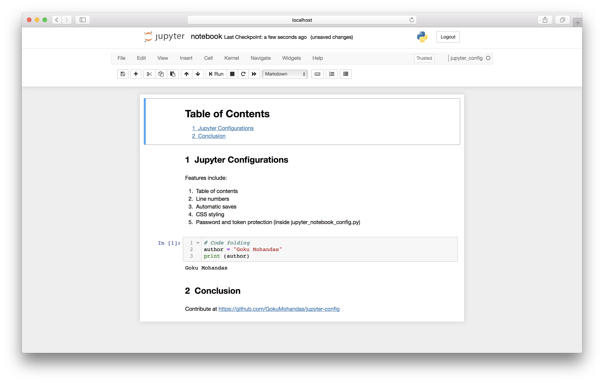

# Jupyter Configuration
Configuration files for a customized Jupyter notebook feature set. Features include:
1. Table of contents
2. Line numbers
3. Automatic saves
4. CSS styling
5. Password and token protection (inside jupyter_notebook_config.py)


## Getting started
1. Create a virtual environment
```bash
python3 -m pip install --upgrade pip
python3 -m pip install virtualenv
virtualenv -p python3.6 venv
source venv/bin/activate
```
2. Install necessary packages
```bash
python3 -m pip install jupyter
python3 -m pip install ipykernel
python3 -m pip install jupyter_contrib_nbextensions
```

3. Create a kernel for this proejct
```bash
ipython kernel install --user --name=jupyter_config
```

4. Create the configuration files
```bash
jupyter notebook --generate-config -y
jupyter contrib nbextension install --user
rm -rf ~/.jupyter/jupyter_notebook_config.json
rm -rf ~/.jupyter/jupyter_nbconvert_config.json
cp jupyter_notebook_config.py ~/.jupyter/
mkdir ~/.jupyter/custom
cp custom/custom.css ~/.jupyter/custom/
mkdir ~/.jupyter/nbconfig
cp nbconfig/notebook.json ~/.jupyter/nbconfig/
```

5. Run Jupyter
```bash
jupyter notebook
```

6. Create a notebook by pressing `New` → `jupyter_config`


